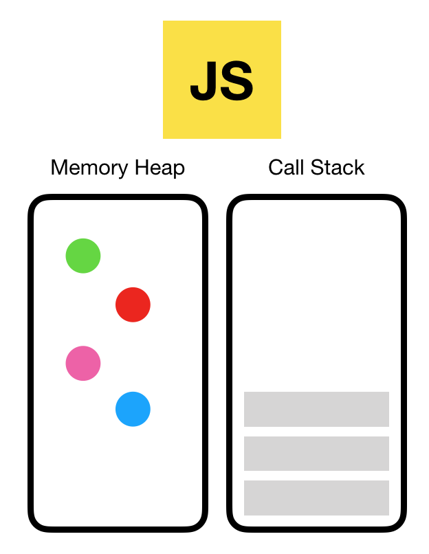
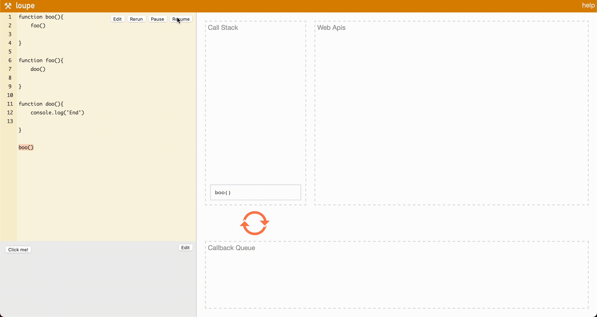
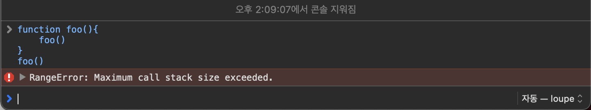
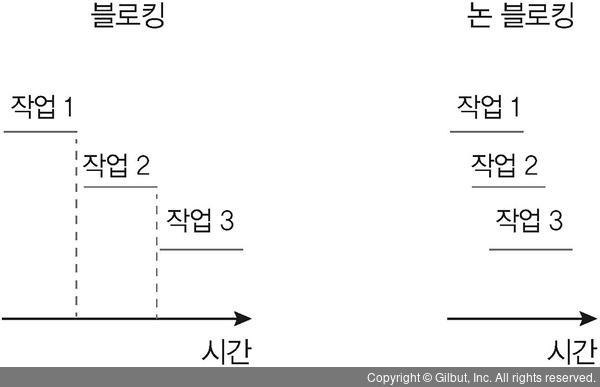

# Node.js 디자인 패턴 발표자료 수집
- 자바스크립트는 **하나의 호출 스택을 가지는 싱글 스레드 프로그래밍 언어**이다.  
스레드가 하나라는 것은 한 번에 한 작업만 처리할 수 있다는 것으로 코드 실행 순서대로, 동기적으로 호출 스택이 쌓여서 처리된다.  

 

## 자바스크립트 엔진
> 가장 대중적인 자바스크립트 엔진은 구글의 V8 엔진으로, 크롬과 Node.js 안에서 동작한다.  
자바스크립트 엔진은 다음과 같은 두 가지 구성 요소로 이루어져 있다.

- 메모리 힙(Memory Heap): 객체는 힙, 대부분 구조화되지 않은 메모리 영역에 할당된다. 변수와 객체에 대한 모든 메모리 할당은 여기서 발생한다.
- 호출 스택(Call Stack): 코드가 실행될 때 호출 스택이 쌓인다.

 

## 자바스크립트 실행환경(Runtime)
> 브라우저에는 자바스크립트 개발자가 사용하는 거의 모든 API가 존재한다.(Ex. setTimeout)  그러나 이런 API들은 엔진에서 제공해주지 않는다.

  

- 브라우저는 단순히 엔진 하나만으로 구성되어 있지 않고, DOM, AJAX, setTimeout 등 브라우저에서 제공하는 Web API이라고 하는 것들이 존재한다.  
- 또한 이러한 Web API의 호출을 통제하기 위한 Event Queue와 Event Loop도 존재한다.

 

## 호출 스택(Call Stack)
> 자바스크립트는 단일 스레드 프로그래밍 언어이므로 단일 호출 스택이 존재한다. 단일 호출 스택이 있다는 것은 한 번에 하나의 일(Task)만 처리할 수 있다는 뜻이다.

- 엔진이 이 코드를 실행하기 전에는 호출 스택이 비어있지만, boo() 함수가 호출되고 나면 이후 foo(), doo() 함수가 호출 스택에 쌓이고 LIFO 방식으로 처리되게 된다.

 

## Stack Overflow
> 이름 그대로 Stack의 사이즈를 초과하였을 때 발생하는 오류이다.  

- 마지막 줄에 foo() 함수가 실행되는데, foo() 내부에서 재귀함수가 존재하므로 스택 프레임이 호출 스택에 계속적으로 쌓이게 되면서 호출 스택의 실제 크기를 초과하게 되면 위와 같은 오류를 발생 시키면서 함수를 종료시킨다.

  

## 자바스크립트에서의 Synchronous(동기)와 Asynchronous(비동기)
> 동기와 비동기는 동시성 관점에서 접근하는 방식이다.   

 

## Synchronous(동기)
> 요청 처리가 완료된 후에 다음 요청을 처리하는 방식으로 이전 요청을 처리하는 시간이 다음 요청에 영향을 준다.
~~~js
const name = 'YEONGUK'
const age = 25
const nationality = 'South Korea'

console.log(name)	// YEONGUK
console.log(age)	// 25

function getNationality(nationality){
	return nationality
}

console.log(getNationality(nationality))	// South Korea
~~~

위의 코드에서 실행 결과는 예상한대로 `YEONGUK`, `25`, `South Korea`가 나오는 것을 확인할 수 있다.

 

## Asynchronous(비동기)
> 하나의 요청 처리가 완료되기 전에 다음 요청을 처리하는 방식으로 요청과 응답이 다른 시간대에 일어날 수 있다.
~~~js
console.log('First')
setTimeout(() => {
  console.log('Second');
}, 0);
console.log('Third')
~~~

위의 코드에서 실행 결과는 `First`, `Third`, `Second`순으로 출력되게 된다.  
그 이유는 setTimeout() 함수는 Web API에서 제공하는 비동기 함수로 Web API에서 작업이 끝나면 Callback Queue로 이동하는데, Call Stack에 작업이 없을 경우에만 이동하기 때문에 남은 작업이 존재하지 않는 마지막에 실행되기 때문이다.

  

### Callback
> 다른 함수의 인자로 사용되거나 이벤트에 의해 호출되어지는 함수를 말한다. 즉, 어떤 함수의 요청이 처리되어 나온 그 값을 callback하여 다른 함수에서 사용할 수 있는 것을 callback이라 부른다.
~~~js
// 익명의 함수를 사용하는 콜백함수 예제
let temp = [1, 2, 3, 4, 5]
temp.forEach(x => console.log(x * 2))

// 함수의 이름과 값을 넘기는 콜백 함수
function doSomething(number, callback) {
    callback(number * number)
}

function getSomething(result){
    console.log(`결과 값: ${result}`)       // 결과 값: 5
}

doSomething(5, getSomething)
~~~
- 그러나 callback 함수를 너무 많이 중첩하여 사용하면 함수끼리 서로 꼬여 에러가 발생할 수도 있으며, 가독성이 크게 떨어지는 콜백 헬(Callback Hell)이 발생할 수 있다.

  

### Promise
> callback의 문제점을 해결하기 위해 나온 개념으로, callback을 예측 가능한 패턴으로 사용할 수 있도록 도와주며 callback 내의 Promise 객체를 활용하여 성공, 실패, 오류 등 다양한 상황에 따른 후속처리를 가능하게 한다.
~~~js
function EvenOrOdd(number){
	return new Promise((resolve, reject) => { 
        if(number % 2 === 0){
            resolve('Even Number')
        }else{
            reject(new Error('Odd Number'))
		}        
    })
}

test(5)
    .then((resolve) => { console.log(resolve) })
    .then().catch((err) => { console.eror(err) })
~~~

- 위 함수와 같이 함수의 처리 순서에 따라 callback을 작성할 수 있어 유지보수에 적합하고, `resolve()`외에 `reject()`를 넣어 각 상황에 따라 다른 함수로 처리되게 할 수도 있다.

  

### async & await
> `async`와 `await`은 상당히 직관적으로 동기 함수 앞에는 `async`를 붙이고 비동기 함수 앞에는 	`await`을 붙이면 된다. function 앞에 `async`를 붙이면 해당 함수는 항상 Promise를 반환하고, Promise가 아닌 값을 반환하더라도 이행 상태의 Promise로 값을 감싸 이행된 프로미스가 반환되도록 해야 한다.

~~~js
function process(){
    return new Promise((resolve, reject) => {
        setTimeout(() => {
            resolve('처리 완료')
        }, 2000);
    })
}

async function getProcess(){
    console.log('시작')				// 시작
    console.log(await process())   // (5초 후) 처리 완료 
    console.log('종료')				// 종료
}

getProcess()
~~~
- process() 함수에서는 이행 상태의 Promise를 반환하고, getProcess() 함수의 앞에 async 키워드를 process() 함수를 호출하는 앞 부분에 await 키워드를 붙여 동기적으로 동작하도록 하여 순차적으로 실행되는 것을 확인할 수 있다.

  

## 자바스크립트에서의 Blocking과 Non-Blocking
> Blocking과 Non-Blocking은 `제어점` 관점에서 접근하는 방식이다.

- Blocking은 호출된 함수가 제어권을 넘겨주지 않아, 호출한 함수쪽에서 다른 작업을 수행할 수 없는 상태로 제어권이 돌아오기를 기다리는 것을 말한다.  
그에 반해, Non-Blocking은 제어권이 넘겨지지 않으므로, 대상의 작업 처리 여부와 상관 없이 호출한 함수 측에서 제어권을 가지고 다음 작업을 수행할 수 있다.

  

## 질문 목록

1. 1234
2. 1234
3. 1234

  

# References
1. [자바스크립트 호출 스택(Call Stack) 이해하기](https://new93helloworld.tistory.com/358)
2. [[CS지식] Non Bloking VS Asynchronous / 논블로킹 vs 비동기](https://programming119.tistory.com/238)
3. [[JavaScript] 자바스크립트 런타임(JavaScript Runtime)](https://velog.io/@cheal3/JavaScript-자바스크립트-런타임-Javascript-Runtime)
4. [자바스크립트 동기/비동기 차이점은 무엇일까요?](https://oneroomtable.tistory.com/entry/자바스크립트-동기비동기-차이점은-무엇일까요)
5. [블로킹과 논블로킹 살펴보기](https://nodejs.org/ko/docs/guides/blocking-vs-non-blocking/)
6. [async와 await](https://ko.javascript.info/async-await)
7. [Javascript 동기와 비동기 callback부터 async&await](https://mber.tistory.com/8)
8. [JavaScript Runtime Visualize](http://latentflip.com/loupe)
